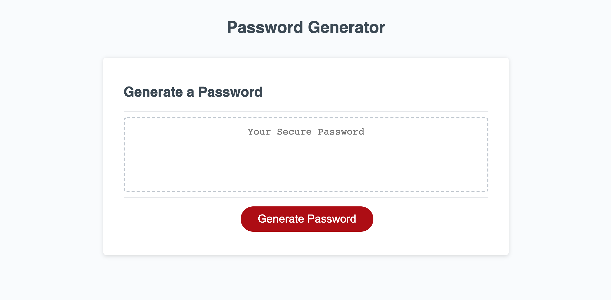

# Password-Generator

## Directions
* Click the generate password button
* add your desired password length using your numer keys
* continue answering prompts using ok for yes and cancel for no
* upon completion you will be provided with a randomly generated password following the parameters you selected using the prompts

## Motivation
I wanted to verify my ability to write a functioning password generator into existence using JavaScript. 

## Why?
Most people don't like thinking of passwords, they don't like trying to make the passwords strong, and lots of jobs require passwords to change monthly. This Generater will combine anywhere from 8 to 128 characters including the choices of lower case, upper case, special characters, and numbers. This solves all the previously mentioned headaches and saves the user time.

## What I learned and how will what I learned solve problems
* how to create and call upon functions 
* how to properly store and access variables when I need them.
* how to interact with the console in a way that allows me to check my scripts function one step at a time during the building process.
* how to use event listeners

 These lessons contain the building blocks of JavaScript with enough higher function to be used as refrence in my future endeavours, whether it be debugging code or creating my own.

## Deployed site

https://iigonzoii.github.io/Password-Generator/

